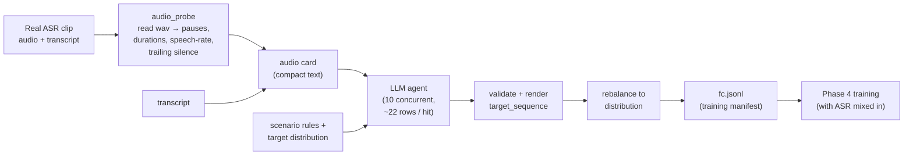
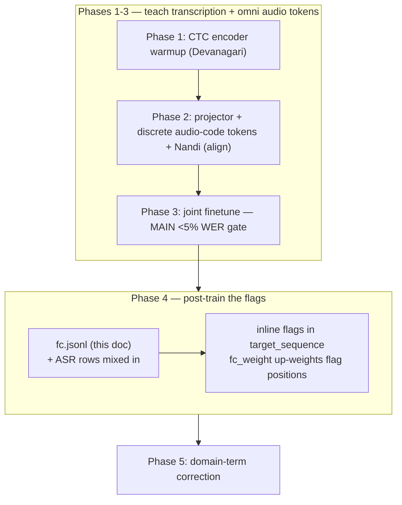

# KupeFDX-hi-asr — Data Generation & Format

This doc covers the **floor-control data**: why it exists, the JSON format, every scenario
with a real sample, the target distribution, and how the audio-aware generation agent works.
(ASR data — audio + transcript — is ordinary; see PLAN.md §1 for sources.)

---

## 1. Why we generate this data

ASR corpora give `audio + transcript`. They do **not** tell the model *when to fire a
floor-control signal* — backchannel, thinking-sound, end-of-speech, silence. So we
manufacture that supervision: take real Hindi clips, **read the audio** for its pause /
timing structure, and have an LLM agent place the flags correctly across realistic
scenarios — including plenty of **traps** (a pause that is NOT end-of-speech) and
**nothing-happens** rows, so the model doesn't over-fire.

### Core rule — "nothing happens" is the *absence* of a token

Flags are emitted **inline in the transcript stream, only at the moment the event
occurs**. There is no per-frame `<NOP>` spam. A midsentence pause that is not a turn
boundary carries the pause in `audio_features` but **no flag in `target_sequence`**. That
absence is what teaches the model restraint.



---

## 2. Flags (mutually exclusive; at most one per pause; never on speech)

| Flag | When | Surface word? |
|---|---|---|
| `<EOS_SPEECH>` | user turn genuinely finished (semantic completeness **and** a real trailing pause) | no |
| `<BC>` | short ack **while the user is still speaking**, at a natural micro-pause | yes — plain (हाँ/अच्छा/हूँ/जी) **or emotional** (हाहाहा/उफ़/ओह/अरे/वाह) |
| `<THINK>` | filler while the **system** composes a reply — only **after** `<EOS_SPEECH>` | yes (हम्म/उम्म/आह/देखिए) |
| `<SILENCE>` | sustained low-speech stretch that is **not** a turn boundary | no |
| *(none)* | nothing happens — ordinary speech, hesitations, breaths, mid-utterance pauses | — |

`<BC>` and `<THINK>` are followed by their spoken surface word in the target, so the model
learns the actual word too, not just the abstract signal.

---

## 3. JSON format (one row = one audio-grounded example)

The trainer reads `audio` + `target_sequence`. Everything else is analysis/provenance kept
so the data is auditable and re-renderable (`schema.render_target`).

```jsonc
{
  "id": "train_0008_fc000",
  "lang": "hi",
  "domain": "general",                 // medical | technical | support | general
  "scenario": "midsentence_pause",     // one of the 8 scenarios (§5)
  "audio": "data/raw/wavs/train_0008.wav",   // the clip this row is grounded on
  "transcript": "यह तकनीकी समस्या है",         // plain transcript (CTC target + WER ref)

  "audio_features": {                  // extracted by READING the wav (audio_probe)
    "duration_s": 4.20, "sample_rate": 16000,
    "n_pauses": 1,
    "pauses": [{"start_s": 1.20, "end_s": 1.85, "dur_s": 0.65}],
    "leading_silence_s": 0.10, "trailing_silence_s": 0.30,
    "speech_fraction": 0.86, "mean_energy_db": -22.5
  },

  "timeline": [                        // decision points along the utterance
    {"kind": "speech", "t_s": 0.10, "text": "यह तकनीकी"},
    {"kind": "pause",  "t_s": 1.20, "dur_s": 0.65},          // TRAP: real pause, NO flag
    {"kind": "speech", "t_s": 1.85, "text": "समस्या है"}
  ],

  "target_sequence": "यह तकनीकी समस्या है",   // rendered; what Nandi decodes (no flag here)
  "flags": [],                          // flags actually present (for balancing/metrics)
  "provenance": "audio-derived-llm"
}
```

**Field rules** (enforced by `fcgen/schema.validate_row`):
- `timeline` non-empty; `t_s` non-decreasing, within `[0, duration]`.
- a `speech` segment never carries a `flag`; a `pause` carries at most one.
- `<BC>`/`<THINK>` require a non-empty `surface`.
- `target_sequence` is re-derived from `timeline` and must be non-empty.

---

## 4. Rendering rule (`timeline → target_sequence`)

```
speech segment                     -> its text
pause + <BC>/<THINK>               -> "<FLAG> <surface>"
pause + <EOS_SPEECH>/<SILENCE>     -> "<FLAG>"
pause with no flag (NOP / trap)    -> nothing
```

---

## 5. The 8 scenarios + real generated samples

Samples below are actual rows from `samples/fc_samples.jsonl` (generated by the mock agent;
the real agent produces richer, clip-grounded variety). Only `target_sequence` is shown for
brevity — each is a full row like §3.

| Scenario | Intent | `target_sequence` sample |
|---|---|---|
| `nothing_happens` | ordinary speech, no control token (pure ASR) | `कृपया थोड़ी मदद करें` |
| `clean_end_of_speech` | turn clearly finished | `कृपया थोड़ी मदद करें <EOS_SPEECH>` |
| `midsentence_pause` | **trap**: real pause, not turn-end | `यह तकनीकी समस्या है` |
| `backchannel` | ack mid-turn at a micro-pause | `मेरा नाम <BC> जी राहुल है` |
| `expression` | **emotional** reaction as `<BC>` (laughter/sigh), only when context warrants | `नमस्ते आप <BC> आह कैसे हैं` |
| `thinking_sound` | post-turn system filler | `मुझे दवा चाहिए <EOS_SPEECH> <THINK> हम्म` |
| `sustained_silence` | low-speech stretch, not turn-end | `धन्यवाद आपका दिन शुभ हो <SILENCE>` |
| `false_trigger_trap` | filler/hesitation, no flag | `उम्म मेरा नाम राहुल है` |
| `barge_in` | user resumes after a pause, no flag | `नमस्ते आप कैसे हैं` |

Note how the four **no-flag** scenarios (nothing / midsentence / false-trigger / barge-in)
are the majority — that is the over-fire defence made concrete.

---

## 6. Target distribution (the anti-over-fire contract)

Defaults in `fcgen/scenarios.py`, **overridable in `configs/*.yaml` under `fc.distribution`**
(no code edit), enforced post-hoc by `rebalance()`:

| Scenario | Target share |
|---|---|
| nothing_happens | 20% |
| backchannel | 18% |
| clean_end_of_speech | 15% |
| midsentence_pause (trap) | 12% |
| expression (emotional `<BC>`) | 8% |
| thinking_sound | 8% |
| false_trigger_trap | 8% |
| sustained_silence | 6% |
| barge_in | 5% |

**Why this mix.** Humans backchannel a lot, so backchannel + expression together are ~26%
— the agent reacts often, as a real listener does. But ~45% of rows still carry **no flag**
(nothing / midsentence / false-trigger / barge-in), because the goal is not "fire rarely" —
it is "fire *appropriately*". Frequent-but-correct beats rare-but-random. Phase 4 also mixes
in ordinary ASR rows, raising the effective no-flag mass further. Tune the whole mix per
deployment via `fc.distribution`.

**Semantic correctness (enforced, not hoped).** `schema.validate_row` drops any row where a
flag contradicts the transcript/context: `<THINK>` must follow an `<EOS_SPEECH>`; `<BC>`
cannot precede any speech or appear after `<EOS_SPEECH>`; at most one `<EOS_SPEECH>`, and no
speech may follow it (only `<THINK>`). The agent prompt additionally forbids forcing a flag
the words don't justify, and restricts emotional expressions to genuinely funny/surprising/sad
contexts.

---

## 7. The generation agent

`src/kupefdx/fcgen/generate.py` — one module, provider-agnostic (any OpenAI-compatible
endpoint; default Krutrim `gemma-4-31b-it`). Set `KUPE_LLM_BASE_URL`, `KUPE_LLM_API_KEY`,
`KUPE_LLM_MODEL`. It produces **both** floor-control (`generate_fc`) and domain-correction
(`generate_domain`) rows through the same request loop.

- **Audio-aware:** each clip's wav is probed (`audio_probe.probe`) into a compact text
  **audio card** (duration, pause list with timings, trailing silence, speech-rate). The
  agent grounds every row in that card — it cannot invent pauses that contradict the audio.
- **~22 rows per LLM hit**, `clips_per_hit=5` clips per prompt (configurable).
- **SSE streaming** with a **colored per-request line** (green OK / red FAIL, latency,
  rows kept, running token/cost). `--show-stream` prints one call's live token stream.
- **Resumable:** a `ShardLedger` marks each batch done; a re-run skips finished batches,
  rows are appended after every hit, and the manifest is mirrored to the Hub every
  `--sync-every` requests — a crash or dropped SSH loses nothing.
- **Validated + rebalanced:** every row passes `schema.validate_row`; the corpus is capped to
  the target distribution before writing.
- **`--mock`** generates deterministic, schema-valid rows offline (no keys) — used by the
  smoke test to exercise the whole path.

### Run it (FC + domain in one command)

```bash
# offline dry-run (proves the generator end to end, no keys)
python scripts/gen_data.py --config configs/en.yaml \
    --src data/manifests/train.jsonl --mock --limit 200 --no-push

# real generation — both sets, high concurrency, auto-synced to the Hub
python scripts/gen_data.py --config configs/en.yaml \
    --src data/manifests/train.jsonl --concurrency 40 --sync-every 25

# then train the floor controller on it (ASR mixed in for anti-forgetting)
python scripts/03_train.py --config configs/en.yaml --phase 4 \
    --set data.manifest=data/manifests/fc.jsonl
```

---

## 8. How it plugs into training



The floor-control loss (`model._fc_extra_loss`) up-weights CE **only on flag-token
positions**, so rare signals are learned without the no-flag majority drowning them out —
while the no-flag majority itself teaches restraint. Evaluation
(`evaluate.run_eval` → `metrics.fc_prf`) reports per-flag precision/recall/F1 **and** a
false-fire rate measured on the no-flag rows.

---

## 9. Streaming I/O spec — and why the model stays quiet

### Input
- **Raw audio:** 16 kHz mono streaming chunks (320–640 ms/chunk).
- **Chat context:** prior turns + a domain tag (`medical`/`technical`/`general`) — fed to
  the decoder as a `<hist> domain : turn | turn </hist>` prefix (`collate._ctx_ids`).

### Output — ONE record per chunk (`stream.StreamingSession.push`)
```json
{
  "chunk_id": 42, "timestamp_ms": 2560,
  "raw_ctc_transcript": "sugar bhi hai",
  "corrected_transcript": "sugar bhi hai",
  "backchannel": null, "thinking_sound": null,
  "eos_flag": false, "silence_flag": false
}
```
All four signal fields are `null`/`false` on an ordinary chunk — the model only advances
the transcript. A signal appears **only when it clearly fires**:
- `backchannel`: `"haan"` mid-turn · `thinking_sound`: `"hmm"` post-turn ·
  `eos_flag: true` at turn end · `silence_flag: true` on a sustained gap.

### The stability mechanism (this is the answer to "don't keep producing things")

There is a dedicated **per-chunk floor-control head** (`floorcontrol.FloorControlHead`)
whose classes are `[NOTHING, <BC>, <THINK>, <EOS_SPEECH>, <SILENCE>]`. Three things make
NOTHING the confident default:

1. **Data:** every ordinary ASR chunk is a NOTHING example, so the vast majority of the
   head's training targets are NOTHING. It *learns to stay quiet*.
2. **Loss:** trained with class weights that up-weight the rare signals so they remain
   learnable — but NOTHING still dominates the data.
3. **Inference guard (`StreamDecider`):** a signal is emitted only if its probability
   clearly beats NOTHING **and** passes a confidence threshold, **and** anti-chatter
   hysteresis (a minimum gap between `<BC>`/`<THINK>` fires; `<EOS_SPEECH>` latches until
   the turn resets). So even if logits wobble, it cannot fire on every chunk.

The head also gets a NOTHING baseline already in **Phase 3** (`fc_chunk_weight=0.2` on
pure-ASR chunks), before Phase 4 adds the rare events — so it enters flag training already
biased toward silence. Smoke run: on a random-init model the streamer emitted a signal on
**0 of 3** chunks — the quiet default holds by construction.

Cost note: CTC (`raw_ctc_transcript`) runs every chunk (cheap); the Nandi AR
`corrected_transcript` is throttled (refreshed at end-of-turn and every `correct_every`
chunks) so it is stable, not re-decoded and flickering each chunk.

### Controllable at inference (the "temperature" analog)

Firing is a **dial, not a fixed policy** — `floorcontrol.StreamControls`, set in
`configs/*.yaml` under `stream:` and overridable per call:
- **`temperature`** — sharpen (`<1`) or flatten (`>1`) the per-chunk softmax.
- **`biases[<flag>]`** — eagerness: `+` fires that signal more, `−` suppresses it. E.g.
  `--bc-bias 1.0` makes the agent backchannel more without any retraining.
- **`thresholds[<flag>]`** — minimum probability to fire (e.g. raise `<EOS_SPEECH>` to commit
  to turn-end more conservatively).
- **`min_gaps[<flag>]`** — anti-chatter gap in chunks; **`enabled[<flag>]`** — turn a signal
  off entirely (e.g. `--no-think`).

The **word** spoken is separate from the **decision**: the per-chunk head decides *when*; the
surface word (हाँ / हाहाहा / हम्म …) is what Nandi generates after the flag in AR mode
(`StreamingSession._surface`), so emotional expressions emerge from context. Fast-path
defaults come from the `SURFACES` inventory.

### Case coverage
| Your case | Handled by | Result |
|---|---|---|
| ordinary chunk, transcript only | head → NOTHING (default) | all signal fields null/false |
| backchannel fires | head class `<BC>` + surface | `backchannel: "haan"` |
| thinking sound | head class `<THINK>` (post-EOS) | `thinking_sound: "hmm"` |
| end of turn | head class `<EOS_SPEECH>`, latches | `eos_flag: true` |
| sustained silence | head class `<SILENCE>` (higher threshold) | `silence_flag: true` |
| domain correction | Phase 5 rows (§10), context prefix | `corrected_transcript` differs from raw |

---

## 10. Domain-correction training record (Phase 5)

Format (as specified) and how it maps to a training row (`fcgen/generate.py`):

```json
{
  "domain": "medical",
  "omni_raw_transcript": "the patient has high blood pressure and diabetees",
  "context": ["Agent: kya lagta hai symptoms kya hain?", "User: sugar bhi hai aur bp bhi"],
  "corrected_transcript": "the patient has hypertension and diabetes",
  "correction_spans": [
    {"raw": "high blood pressure", "fixed": "hypertension", "reason": "domain term"},
    {"raw": "diabetees", "fixed": "diabetes", "reason": "spelling/ASR error"}
  ],
  "chunk_boundaries_ms": [0, 620, 1240, 1860]
}
```
Mapping: `text` = `omni_raw_transcript` (CTC / raw-acoustic target), `target_sequence` =
`corrected_transcript` (Nandi's target), `context`+`domain` become the decoder prefix,
`correction_spans`/`chunk_boundaries_ms` are provenance. **Clean split:** CTC learns what
the audio literally says; Nandi learns to correct it from domain + context. Generate with
`scripts/gen_data.py --only domain` (mock or real LLM).
