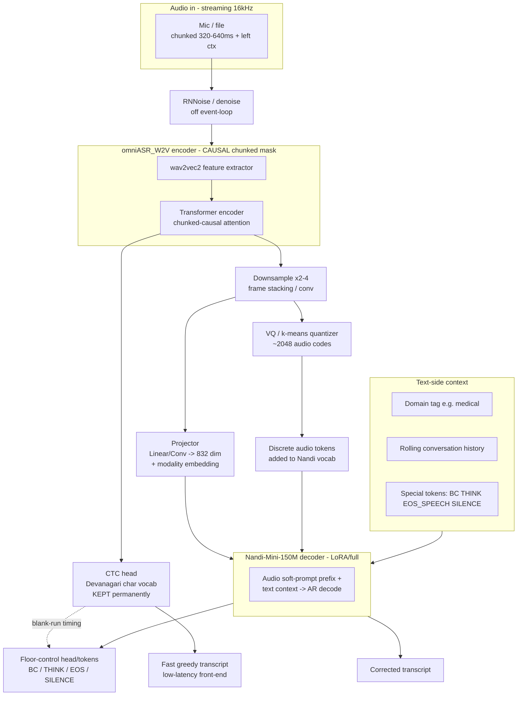

# KupeFDX-hi-asr — End-to-End Plan

**Goal:** A streaming, almost-full-duplex Hindi voice system that (a) transcribes at **< 5% WER**, (b) corrects domain terminology live, and (c) emits floor-control signals — backchannel, thinking-sound, end-of-speech, silence — conditioned on live context. Hindi first; architecture designed to scale to 10 Indic langs + English.

**Two fused open-weight foundations:**
- **Encoder** = `omniASR_W2V` (Meta Omnilingual SSL wav2vec2 backbone — *raw self-supervised*, no baked-in vocab → no tokenizer mismatch). Feature extractor only.
- **SLM** = `Nandi-Mini-150M` (FrontiersMind). Custom `nandi` arch, `trust_remote_code`. **hidden=832, vocab=131072 (BPE, Hindi/Devanagari native), 16 layers × 2 layer-sharing, factorized embeddings rank=196, tied embeddings, ctx=2048, bf16.**

> These real numbers drive every dimension below. The projector output dim is **832**. Any new tokens we add must go through Nandi's *factorized* embedding (A[V×196] @ B[196×832]) and its *tied* head — we cannot naively `resize_token_embeddings`; we extend the factor matrices. See Phase 4.

---

## 0. The core design question — is this the right architecture?

The reference doc proposes: freeze-then-finetune W2V encoder → projector → Nandi. I largely agree, **with three deliberate contradictions of the reference:**

1. **Add a CTC auxiliary head on the encoder, kept for the whole project — not thrown away.** The reference frames CTC as merely "a way to finetune the encoder." I keep the CTC head *permanently* as (a) a monotonic-alignment anchor that makes the AR decoder converge far faster and hallucinate less, (b) a cheap fast-path greedy transcript for the streaming front-end, and (c) a free VAD/end-of-speech signal source (CTC blank-run length). This is the single biggest lever for hitting <5% and for the full-duplex signals — free timing information the reference discards.

2. **"Teach Nandi to understand the omni encoder's audio tokens" → do it with BOTH continuous soft-prompts AND discrete audio tokens.** Continuous projector features carry acoustic detail (best WER). But we *also* quantize encoder features (k-means / RVQ, ~2048 codes) into discrete "audio-token" IDs added to Nandi's vocab, and interleave a few of them. Rationale: discrete audio tokens live in the same embedding table as text, so Nandi learns a shared audio↔text space that (a) generalizes floor-control signals better and (b) is what lets the *same* trick scale to other languages cheaply. This is the "teach Nandi audio tokens" requirement, done properly — not hand-waved.

3. **Causal/chunked encoder from Phase 1, not bolted on at the end.** The reference notes streaming is "a separate modification." I disagree with deferring it: retrofitting causality after training a bidirectional encoder wrecks WER. We train with a **chunked causal attention mask** (chunk ≈ 320–640ms + small left context) from the start, so the <5% number we validate is the *streaming* number, not an offline number we'll later regress from.

If any of these three proves to hurt WER in Phase 2 ablations, we drop it — but they start in.

---

## 1. How many hours of Hindi to hit < 5% WER?

Reasoning, not a guess:

- The W2V backbone is **already massively multilingual-pretrained** (Omnilingual, 1600+ langs, Hindi included). We are *finetuning* representations, not learning acoustics from scratch — this is the regime where a few thousand hours suffices.
- Public reference points: AI4Bharat IndicWav2Vec / IndicWhisper land ~10–15% WER on hard Hindi benchmarks; the sub-5% regime needs **clean, well-segmented, correctly-transcribed** data and a strong decoder LM. Nandi (525B-token Hindi LM) is a strong decoder prior — it fixes exactly the errors (agreement, spelling, domain terms) that push WER from 8%→5%.
- Data quality dominates volume past ~1.5k h. Noisy 5k h < clean 2.5k h.

**Budget (the "decent, not minimal, not maximal" target):**

| Split | Hours | Purpose |
|---|---|---|
| Core clean train | **2,500 h** | main ASR signal, curated & filtered |
| Domain packs (medical / tech / support / general) | **+400 h** | real terminology coverage |
| Floor-control / conversational (turns, pauses, EOS, "nothing happens" negatives) | **+300 h** (mostly synthetic + mined) | Phase 4 signals |
| **Total training** | **≈ 3,200 h** | |
| Dev (held-out, clean) | 15–20 h | early stopping, WER curve |
| Test (blind, multi-domain + benchmark) | 3 sets ≈ 25 h | Kathbath, Common Voice hi, in-house domain test |

**Sources (all freely available, more than enough to reach 3.2k h):**
Shrutilipi (~6,400 h hi) · IndicVoices / IndicVoices-R · Kathbath (Bhasha-Abhijnaanam) · Vaani · Spring-INX · MUCS 2021 · Common Voice hi · Google FLEURS hi · Gramvaani. We *select* the cleanest ~3.2k h via the filtering pipeline (§3), not dump all of it.

**Success gate:** < 5% WER on the blind clean test set (streaming config), < 8% on noisy/domain test. If Phase-3 stalls at 6–7%, the lever is *more clean data + harder filtering*, not more epochs.

---

## 2. Architecture



**Data flow:** audio → denoise → causal W2V encoder → (i) CTC head for alignment + fast transcript + timing, (ii) projector→832-d continuous soft prompts, (iii) quantizer→discrete audio tokens. Nandi consumes soft prompts + interleaved audio tokens + domain tag + conversation history, and autoregressively emits `corrected transcript + floor-control tokens`.

**Sequence layout fed to Nandi (one training example):**
```
[BOS] <domain=medical> <hist>…prev turns…</hist> <audio> {soft-prompt frames}⊕{a few audio-token IDs} </audio> → target: कैप्सूल दिन में दो बार <EOS_SPEECH>
```

**New special tokens** (added via extending factorized embedding factors, not resize):
`<audio>` `</audio>` `<domain=…>` `<hist>` `</hist>` `<BC>` `<THINK>` `<EOS_SPEECH>` `<SILENCE>` `<NOP>` + 2048 `<aud_k>` audio-code tokens.

**Floor-control definitions (non-overlapping — the reference's stated risk):**
- `<SILENCE>`/`<NOP>` — default; nothing to emit. **Vast majority of frames.**
- `<BC>` — short listener acknowledgment during *user still speaking* + a natural micro-pause (हाँ / अच्छा / हूँ).
- `<THINK>` — filler while *system* is composing a long answer, only after a user turn ends.
- `<EOS_SPEECH>` — user turn genuinely finished (semantic + acoustic; CTC blank-run + prosody + semantics all agree).
Mutually exclusive per frame; trained with heavy `<NOP>` negatives so the model does not over-fire.

---

## 3. Pipeline stages, scripts, and resumability

Every stage writes an **atomic shard-level manifest with a `state` column** (`pending|done|failed`) in a SQLite/JSONL ledger under `data/manifests/`. Re-running any script **skips `done` shards** and only reprocesses `pending|failed`. Same pattern as our other Kupe training folders. All heavy stages use **multi-GPU / multi-worker** parallelism.

### Stage 1 — Data prep (`scripts/01_dataprep/`)
| Script | Does | Resume | Parallel |
|---|---|---|---|
| `download_sources.py` | pull each dataset (HF datasets / direct) into `data/raw/<source>/` | per-file checksum ledger | N download workers |
| `build_manifest.py` | unify to `{audio_path, text, dur, source, domain, sr}` JSONL | append-only, dedup by hash | multiprocess |
| `clean_filter.py` | resample 16k mono; drop dur<0.5s or >30s; text-normalize Devanagari (unicode NFC, digit/punct norm); language-ID filter (keep hi); **quality filter**: forced-align score / CER-vs-CTC-teacher, SNR, clipping | shard `state` | GPU LID + multiproc |
| `segment_vad.py` | Silero VAD segmentation for long files; produce turn/pause boundaries for floor-control labels | shard `state` | GPU-shared Silero |
| `make_floorcontrol_labels.py` | derive `<EOS_SPEECH>`/`<SILENCE>`/`<BC>`/`<THINK>` targets from VAD + turn structure; synth backchannel/thinking examples (Sarvam-style, reuse thinkspark recipe); inject abundant `<NOP>` negatives | shard `state` | multiproc |
| `split.py` | train/dev/test split with **speaker-disjoint** + domain-stratified; freeze test set hashes | idempotent | — |

### Stage 2 — Encode / feature-cache (`scripts/02_encode/`)
| Script | Does | Resume | Parallel |
|---|---|---|---|
| `dump_encoder_feats.py` | run W2V encoder (causal mask) → store features (fp16) as WebDataset/`.npy` shards | shard `state` ledger | **multi-GPU DDP**, sharded by rank |
| `fit_quantizer.py` | k-means/RVQ (~2048 codes) on a feature subsample → `quantizer.pt` | checkpoint at k-means iters | GPU |
| `dump_audio_tokens.py` | apply quantizer → discrete token id shards | shard `state` | multi-GPU |
| `build_ctc_targets.py` | Devanagari char vocab + CTC target ids | idempotent | multiproc |

> Encoder feature caching is optional per phase: cache when encoder is **frozen** (Phase 2) for huge speedup; compute on-the-fly when encoder is **trainable** (Phase 3).

### Stage 3 — Training (`scripts/03_train/`) — see §4 phases
`train.py` (single entry, `--phase {1,2,3,4,5}`, Hydra/omegaconf configs in `configs/`), plus `model.py`, `dataset.py`, `collate.py`, `losses.py`. **`torchrun` DDP / FSDP** multi-GPU; grad-accum; bf16; **full checkpoint-resume** (model+optim+sched+dataloader step+RNG) → `--resume auto` picks latest.

### Stage 4 — Eval / validation (`scripts/04_eval/`)
`eval_wer.py` (WER/CER, streaming + offline), `eval_floorcontrol.py` (P/R/F1 per signal, false-fire rate on `<NOP>` set, timing latency), `eval_domain.py` (term-level accuracy per domain). Runs on dev every N steps (logged to wandb) and on blind test at phase end.

### Stage 5 — Inference (`scripts/05_infer/`)
`infer_offline.py` (file → transcript+signals), `stream_server.py` (chunked real-time, KV-cache streaming à la our thinkspark live-agent loop; CTC fast-path + Nandi correction + floor-control), `export.py` (merge LoRA, quantize, package).

---

## 4. Training phases — who / where / with what data

> **Transcript producer = Nandi, always.** The CTC head never produces the final transcript — it only (a) fine-tunes the Omni SSL encoder on Hindi (Stage A) and (b) gives end-of-speech/silence timing. Omni's own CTC weights are never loaded.
>
> **Three stages (five runs):** **A** = adapt encoder on Hindi (phase 1) · **B** = teach Nandi to transcribe from the adapted encoder (phases 2–3, phase 3 = <5% gate) · **C** = floor-control + domain correction (phases 4–5).


| Phase | What trains | Frozen | Data | Loss | Exit gate |
|---|---|---|---|---|---|
| **1. Encoder CTC finetune** | W2V encoder + CTC head (causal mask) | — | 2,500 h core clean | CTC | greedy-CTC WER < ~9% |
| **2. Align projector→Nandi** | Projector + audio-token embeds + Nandi **LoRA** | encoder, CTC, Nandi base | 2,500 h (cached feats) | LM CE on transcript (+ small CTC aux) | AR WER < ~7% |
| **3. Joint finetune** | Encoder (low LR) + projector + Nandi (LoRA or full) | — | 2,500 h + domain 400 h | LM CE + CTC aux | **AR WER < 5% (streaming)** ← main gate |
| **4. Floor-control** | Nandi LoRA + FC token embeds (projector low LR) | encoder | 300 h FC + heavy `<NOP>` negatives, mixed w/ ASR to avoid forgetting | LM CE + weighted FC-token loss | FC F1 > 0.8, false-fire < 2% |
| **5. Domain correction** | Nandi LoRA per-domain adapters | encoder, projector | domain-tagged 400 h + augmented term lists | LM CE, term-focused | domain term acc ↑, no WER regression |

**"Teach Nandi the audio tokens"** happens in Phases 2–3: the projector + the 2048 audio-code embeddings are learned so Nandi maps acoustic content into its 832-d/vocab space. Discrete audio tokens are interleaved (rate ablated in Phase 2).

**Anti-forgetting:** Phases 4–5 always mix in a slice of ASR data so transcription quality and floor-control/correction don't trade off.

---

## 5. HF sync (keep everything synced at each step)

A single helper `src/kupefdx/hfsync.py` + `scripts/hf_push.py`, called at the end of *every* stage:
- **Dataset repo** `FrontiersMind/kupe-hi-asr-data` (private): pushes manifests, quantizer, encoded-shard index, split hashes — versioned, so any machine can `hf_pull.py` and resume identically.
- **Model repo** `FrontiersMind/KupeFDX-hi-asr` (private): pushes each phase checkpoint + config + eval report + wandb run id, tagged `phaseN-stepK`.
- Uses `huggingface_hub.upload_large_folder` with resumable multipart; a `.hfsync_state.json` ledger records last-synced commit per artifact so re-runs are incremental. Manual toggle `--no-push` for local-only iterations.

## 6. Experiment tracking (wandb)
One project `kupe-fdx-hi-asr`, one run per phase (resumed runs keep `run_id`). Logged: loss curves, LR, grad-norm, **WER/CER on dev every N steps**, FC F1 / false-fire, per-domain term acc, throughput (h-audio/GPU-hr), sample decoded transcripts (audio + pred + ref table), GPU mem. Alerts on WER plateau / NaN.

## 7. Testing (`tests/`)
- **Unit:** projector shape, factorized-embedding token extension (critical — verify tied head stays consistent), collate padding/masking, CTC target build, quantizer round-trip.
- **Data integrity:** test set never overlaps train speakers/hashes; manifest `state` machine resume test.
- **Model:** forward/backward on tiny batch each phase; causal-mask leakage test (future frames must not affect current output).
- **Eval:** WER computed matches a reference implementation on a fixed toy set.
- **Inference:** streaming server produces same transcript as offline within tolerance; latency budget check.

## 8. Repo layout
```
kupe-FDX-hi-asr/
├── PLAN.md                      # this file
├── README.md
├── requirements.txt / env.yaml
├── configs/                     # phase1..5 + model + data (omegaconf)
├── data/{raw,manifests,encoded}/
├── scripts/{01_dataprep,02_encode,03_train,04_eval,05_infer}/  + hf_push/pull
├── src/kupefdx/                 # model.py, dataset.py, quantizer.py, hfsync.py, ...
├── checkpoints/  logs/  tests/
```

## 8b. Confirmed decisions (2026-09-11)
- **Train hardware:** single **H100 80GB** (no DDP needed; code stays `torchrun`-ready for later). Encoding may run on any single GPU (H100/L4/4090) or CPU.
- **Nandi adaptation:** **full finetune** (fits easily on H100: W2V ~317M + Nandi 150M + projector, all trainable in bf16).
- **Build order:** everything scaffolded at once, and the whole pipeline must pass an **end-to-end smoke test on this Mac (CPU/MPS)** before it ever runs on the H100. Smoke uses `TinyEncoder` + `TinyNandi` (a faithful factorized-embedding + tied-head + layer-sharing mirror of real Nandi) on synthetic audio, exercising every stage (prep→encode→quantize→train w/ resume→eval→infer→hfsync dry-run) in seconds. Flip `backend: real` in config on the H100 to swap in `omniASR_W2V` + real Nandi with zero code change.
- **Basis:** mirror `kupe-asr-en` conventions (config/env/ledger/hub/collate/Trainer-style resume). Its FastConformer→Nandi fusion is the proven template; we swap the encoder for `omniASR_W2V`, keep CTC, add causal chunking + discrete audio tokens + floor-control.

## 9. Open items to resolve before coding
1. Confirm `omniASR_W2V` exact checkpoint id + license + feature rate/dim (drives projector + downsample factor).
2. Confirm Nandi's `modeling_nandi.py` factorized-embedding API so we can extend tokens safely (spike test first).
3. GPU inventory (count + VRAM) → sets DDP vs FSDP, batch/grad-accum, whether Nandi trains full vs LoRA.
4. Decide discrete-audio-token interleave rate via Phase-2 ablation (start 0, add if it helps).

---
**Recommendation:** ~**3,200 h** curated (2,500 core clean + 400 domain + 300 floor-control) is the sweet spot for < 5% streaming Hindi WER given the strong pretrained W2V backbone and the Nandi decoder prior. Next step: confirm §9 items (esp. GPU count + the two model spikes), then I scaffold `src/kupefdx/model.py` + Phase-1 CTC training first.
